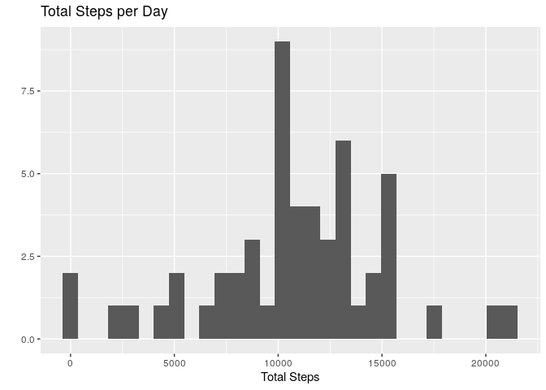
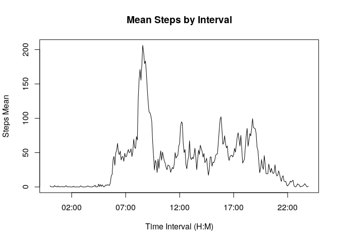
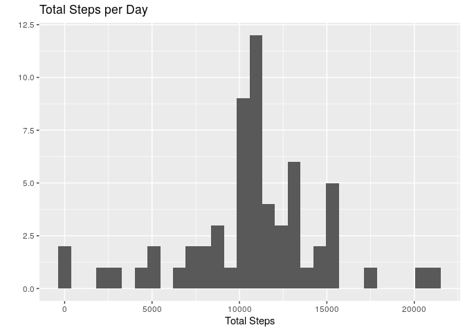
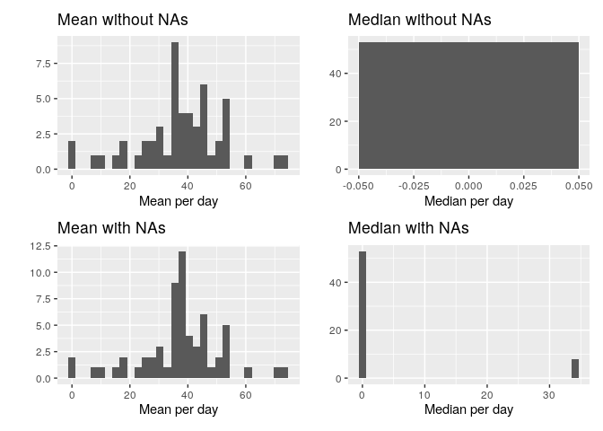
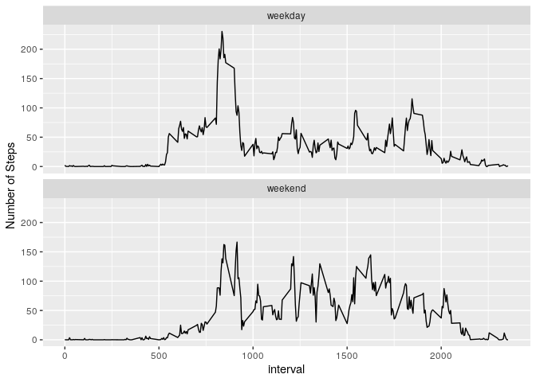

Reproducible Research: Course Project 1
================

## Assignment

This assignment makes use of data from a personal activity monitoring
device. This device collects data at 5 minute intervals through out the
day. The data consists of two months of data from an anonymous
individual collected during the months of October and November, 2012 and
include the number of steps taken in 5 minute intervals each day.

## Including Code

First, sourcing the needed packages.

``` r
library("dplyr")
```

    ## 
    ## Attaching package: 'dplyr'

    ## The following objects are masked from 'package:stats':
    ## 
    ##     filter, lag

    ## The following objects are masked from 'package:base':
    ## 
    ##     intersect, setdiff, setequal, union

``` r
library("ggplot2")
library("lubridate")
```

    ## 
    ## Attaching package: 'lubridate'

    ## The following objects are masked from 'package:base':
    ## 
    ##     date, intersect, setdiff, union

``` r
library("stringr")
library("tidyverse")
```

    ## ── Attaching packages ────────────────────────────────────────────────────────────────── tidyverse 1.3.0 ──

    ## ✓ tibble  3.0.1     ✓ purrr   0.3.4
    ## ✓ tidyr   1.1.0     ✓ forcats 0.5.0
    ## ✓ readr   1.3.1

    ## ── Conflicts ───────────────────────────────────────────────────────────────────── tidyverse_conflicts() ──
    ## x lubridate::as.difftime() masks base::as.difftime()
    ## x lubridate::date()        masks base::date()
    ## x dplyr::filter()          masks stats::filter()
    ## x lubridate::intersect()   masks base::intersect()
    ## x dplyr::lag()             masks stats::lag()
    ## x lubridate::setdiff()     masks base::setdiff()
    ## x lubridate::union()       masks base::union()

``` r
library("patchwork")
library("timeDate")
```

Now, getting the data and storing in a variable, excluding the rows with
missing data.

``` r
unzip("activity.zip")

activity <- read.csv("activity.csv")

activity <- activity[complete.cases(activity), ] 
```

Question 1: What is mean total number of steps taken per day?

First: Calculate the total number of steps taken per day

``` r
steps_perday <- activity %>%
        select(steps, date) %>%
        group_by(date) %>%
        summarise_all(list(sum))
```

Second: Make a histogram of the total number of steps taken each day

``` r
ggplot(steps_perday, aes(x = steps_perday$steps)) +
        geom_histogram() +
        labs(title = "Total Steps per Day", x = "Total Steps", y = "")
```

    ## Warning: Use of `steps_perday$steps` is discouraged. Use `steps` instead.

    ## `stat_bin()` using `bins = 30`. Pick better value with `binwidth`.

<!-- -->

Third: Calculate and report the mean and median of the total number of
steps taken per day

``` r
mean_steps_perday <- activity %>%
        select(steps, date) %>%
        group_by(date) %>%
        summarise_all(list(mean))

median_steps_perday <- activity %>%
        select(steps, date) %>%
        group_by(date) %>%
        summarise_all(list(median))
```

Moving on for the second question: What is the average daily activity
pattern?

First: Make a time series plot (type = “l”) of the 5-minute interval
(x-axis) and the average number of steps taken, averaged across all days
(y-axis)

``` r
mean_by_interval <- tapply(activity$steps, activity$interval, mean)

names(mean_by_interval) <- str_pad(string = names(mean_by_interval), width = 4, pad = "0", side = "left")

plot( parse_date_time(names(mean_by_interval), "HM"), 
      mean_by_interval, 
      type = "l", 
      ylab = "Steps Mean", 
      xlab = "Time Interval (H:M)",
      main = "Mean Steps by Interval")
```

<!-- -->

Now, which 5-minute interval, on average across all the days in the
dataset, contains the maximum number of
steps?

``` r
interval_with_maximum_steps <- names(which(mean_by_interval == max(mean_by_interval)))

interval_with_maximum_steps
```

    ## [1] "0835"

For the rest of the assignment the data with missing values will be
needed, so here we’ll import the data again:

``` r
with_NA <- read.csv("activity.csv")
```

1.  Calculate and report the total number of missing values in the
    dataset (i.e. the total number of rows with NAs)

<!-- end list -->

``` r
total_NAs <- sum(!complete.cases(with_NA))

print(total_NAs)
```

    ## [1] 2304

2.  Devise a strategy for filling in all of the missing values in the
    dataset. The strategy does not need to be sophisticated. For
    example, you could use the mean/median for that day, or the mean for
    that 5-minute interval, etc.

<!-- end list -->

``` r
mean_interval <- with_NA %>%
  select(steps, interval) %>%
  group_by(interval) %>%
  summarise_all(list(mean), na.rm = TRUE)

filling_NA <- left_join(with_NA, mean_interval, by = "interval")
filling_NA$steps.x <- coalesce(filling_NA$steps.x, filling_NA$steps.y)
```

3.Create a new dataset that is equal to the original dataset but with
the missing data filled in.

``` r
filling_NA <- filling_NA %>%
  select(steps.x, date, interval) %>%
  rename(steps = steps.x) 
```

4.Make a histogram of the total number of steps taken each day and
Calculate and report the mean and median total number of steps taken per
day. Do these values differ from the estimates from the first part of
the assignment? What is the impact of imputing missing data on the
estimates of the total daily number of steps?

``` r
sum_filled_NA <- filling_NA %>%
  group_by(date) %>%
  summarise_all(list(sum))

ggplot(sum_filled_NA, aes(x = steps )) +
  geom_histogram() +
  labs(title = "Total Steps per Day", x = "Total Steps", y = "")
```

    ## `stat_bin()` using `bins = 30`. Pick better value with `binwidth`.

<!-- -->

``` r
#calculating mean per day

mean_filled_NA <- filling_NA %>%
  select(steps, date) %>%
  group_by(date) %>%
  summarise_all(list(mean))

#calculating median per day

median_filled_NA <- filling_NA %>%
  select(steps, date) %>%
  group_by(date) %>%
  summarise_all(list(median))
```

To answer the question, here is a plot comparing the values when
calculated with an without the missing
    values:

    ## `stat_bin()` using `bins = 30`. Pick better value with `binwidth`.
    ## `stat_bin()` using `bins = 30`. Pick better value with `binwidth`.
    ## `stat_bin()` using `bins = 30`. Pick better value with `binwidth`.
    ## `stat_bin()` using `bins = 30`. Pick better value with `binwidth`.

<!-- -->

Finally, the last part: Are there differences in activity patterns
between weekdays and weekends?

First, create a new factor variable in the dataset with two levels –
“weekday” and “weekend” indicating whether a given date is a weekday
or weekend
day.

``` r
filling_NA$day <- factor(isWeekday(filling_NA$date), levels = c(TRUE, FALSE), labels = c("weekday","weekend"))
```

Second, make a panel plot containing a time series plot (i.e. type =
“l”) of the 5-minute interval (x-axis) and the average number of
steps taken, averaged across all weekday days or weekend days (y-axis).

``` r
interval_average <- filling_NA %>%
  select(steps, interval, day) %>%
  group_by(interval, day) %>%
  summarise_all(list(mean))

interval_average %>%
  filter(day %in% c("weekday", "weekend") ) %>%
  ggplot() +
  geom_line(aes(x = interval, y = steps)) +
  facet_wrap(~day, nrow = 2) +
  labs(y = "Number of Steps")
```

<!-- -->
